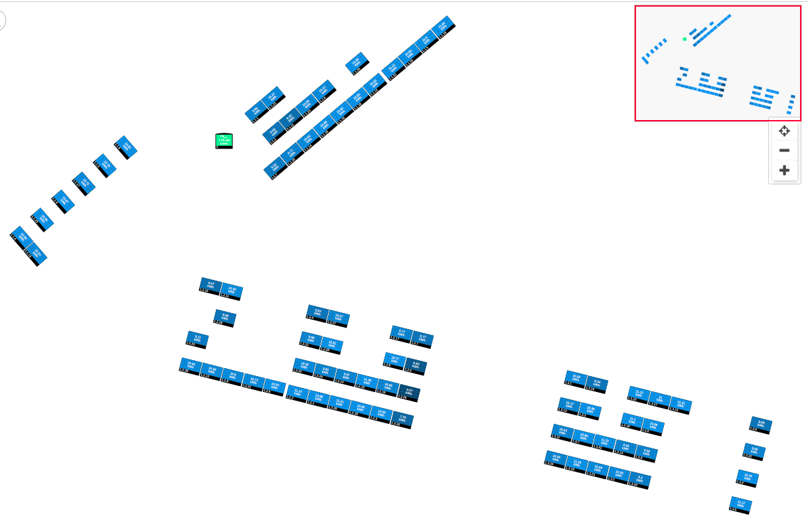
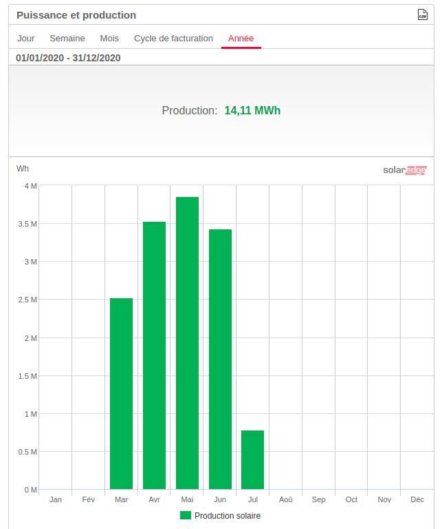

# les panneaux solaires

quelques mots ...§

## Le toit
Le toit avant le projet

## Le projet
Le résumé tehnique du projet 

la proposition [financiere](Photo-Voltaique-projet.pdf) ...

## L'installation

## Le Suivi

Le suivi de la production peut être fait sur le [site](https://monitoring.solaredge.com/solaredge-web/p/login?locale=fr_FR)

Voici un aperçu au 6 juillet 2020

