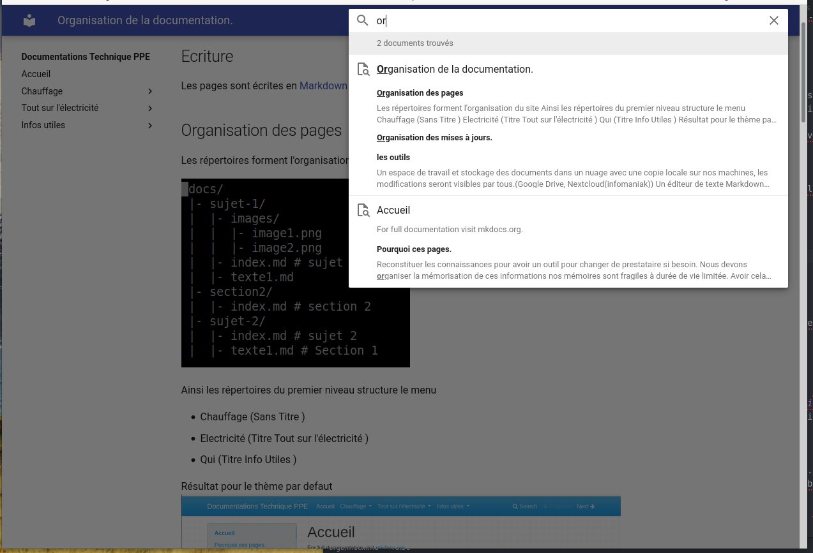
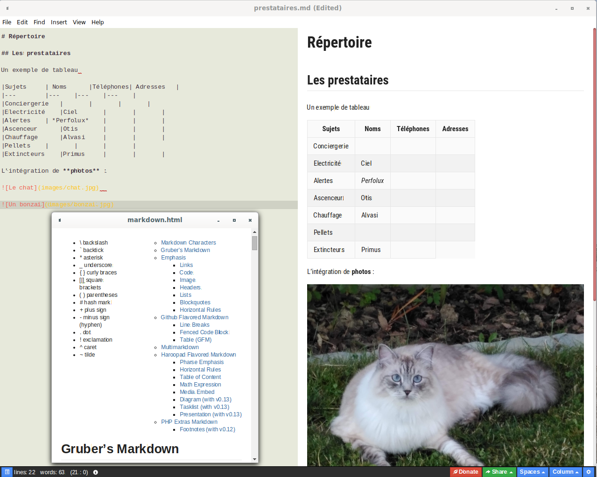
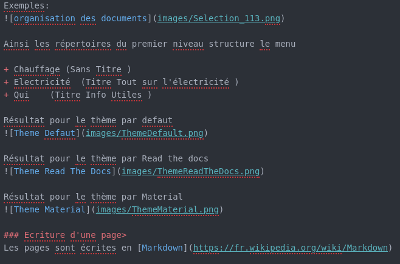

# Organisation de la documentation.

## les outils

Un générateur de site statique : [MkDocs](https://www.mkdocs.org/) utilisant :

+ des plugins
    - search
    - awesome-pages
+ des Themes
    - readthedocs
    - material

+ la bibliothèque Python-Markdown pour produire les documents en HTML.

Intégrant des fonctionnalités de recherche

**Recherche**
   

Un **espace de travail et stockage** des documents dans un nuage avec une copie locale sur nos machines, les modifications seront visibles par tous.(Google Drive, Nextcloud(infomaniak))

Un *éditeur de texte* **Markdown** permettant la visualisation du rendu htlm du texte, je vous propose [haroopad](http://pad.haroopress.com/user.html)

**git** (logiciel de gestion de versions décentralisé.) pour gérer l'historique des modifications et les demandes de corrections d'erreur.

Une **organisation de travail** :

+ une répartition des sujets.
+ Page cachée jusqu'à validation par le comité ou par vous-même.

## Organisation du site

### Les répertoires forment l'organisation du site

Exemples:

Ainsi les répertoires du premier niveau structure le menu

+ Chauffage (Sans Titre )
+ Electricité  (Titre Tout sur l'électricité )
+ Qui    (Titre Info Utiles )

Résultat pour le thème par defaut

Résultat pour le thème par Read the docs

Résultat pour le thème par Material

### Ecriture d'une page

Les pages sont écrites en [Markdown](https://fr.wikipedia.org/wiki/Markdown)

Exemples de la syntaxe

### Alimentation du site
+ Pour créer un nouveau thème on rajoute un répertoire dans le repertoire docs.
+ Pour créer un sous thème on crée un répertoire dans le thème.
* Pour ajouter un contenu on crée un fichier avec un nom quelconque la page apparaitra avec le nom du titre et si pas de titre avec le nom du fichier.

**Voir** page [PhotoVolta](/Electricit%C3%A9/PhotoVolta/) :  Installation Photo Voltaique

## Organisation des mises à jours.

### Archivage & déploiement

La sauvegarde des pages sur github ou ailleurs que j'appelerai *Githeb* dans le reste du document, mais utilisant git

Chaque semaine ou soir un script

+ envoie les modifications des fichiers à la base du site, **répertoire /docs** sur *Githeb*
+ met à jour le site, **répertoire /site** sur *Githeb*
+ publie le site sur la machine l'hébergeant le site de documentation.

### Actions à faire

1. Ouvrir un compte Google (doctech.belorne@gmail.com) Non ,on gerera un workflow avec un responsable de publication ( Pierre pour le momment)

2. Ouvrir un compte git sur un hébergement (github, gitab, framagit, sourceforge) sur cpanel Tizoo à valider
2. Définir où est publié le site.  bel-orne.info/docs

4. Créer les scripts de mise à jour. Installation sur la machine cible. pierre
5. Créer l'organisation des contenus du site

    Technique / sécurisé l'Accés
               Chauffage
                    ventillation
                    relevé des compteurs chauffage
                    relevé des compteurs eau chaude - ecs
               Electricité
                Eclairages communs
                Eclairages exterieurs
                Eclairages de secours
                Photo-Voltaique.
    Fonctionnel / ouvert
            Place de Jeux
            Cuisine
            Parking
            Places visiteurs
            Allées
            Adresses utiles

    accès réservé mots
