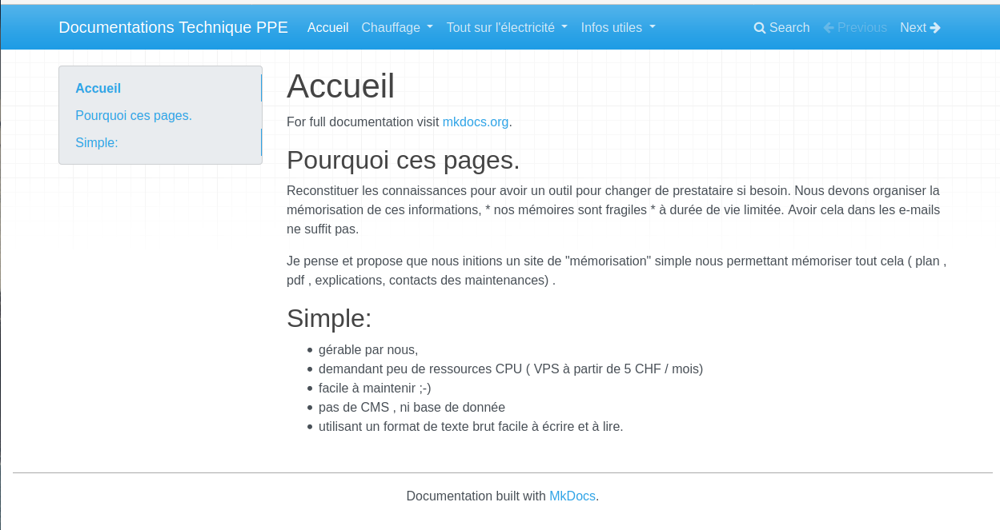
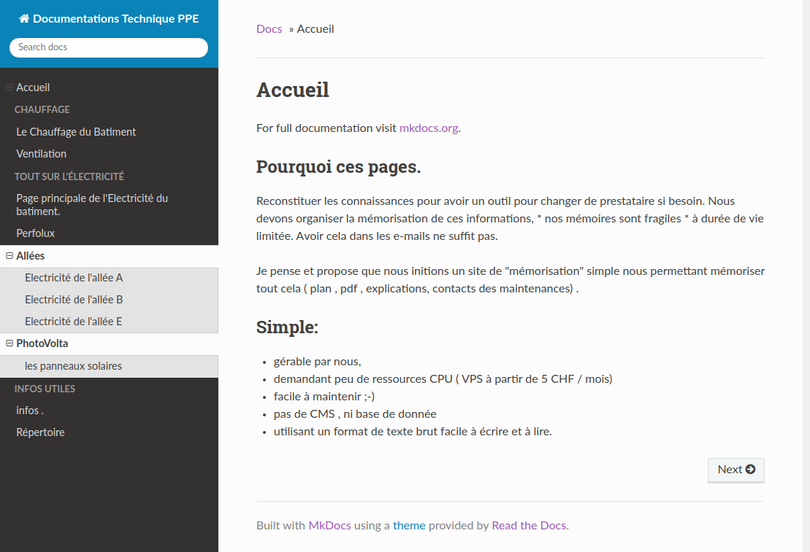
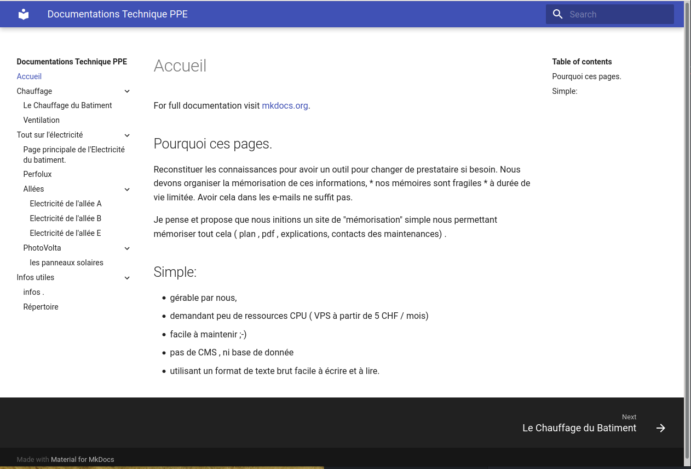

# Organisation de la documentation.

## Ecriture
Les pages sont écrites en [Markdown](https://fr.wikipedia.org/wiki/Markdown)

## Organisation des pages
Les répertoires forment l'organisation du site

Ainsi les répertoires du premier niveau structure le menu

+ Chauffage (Sans Titre )
+ Electricité  (Titre Tout sur l'électricité )
+ Qui    (Titre Info Utiles )

Résultat pour le thème par defaut

Résultat pour le thème par Read the docs

Résultat pour le thème par Material

## Alimentation du site
+ Pour créer un nouveau Thème on rajoute un répertoires
+ Pour créer un sous theme on crée un répertoire dans le themes
* Pour ajouter un contenu on crée un fichier avec un nom quelconque la page appaitra avec le nom du titre

**Voir** page PhotoVolta :  Installation Photo Voltaique

## Déploiement

Organisation des mises à jours.
